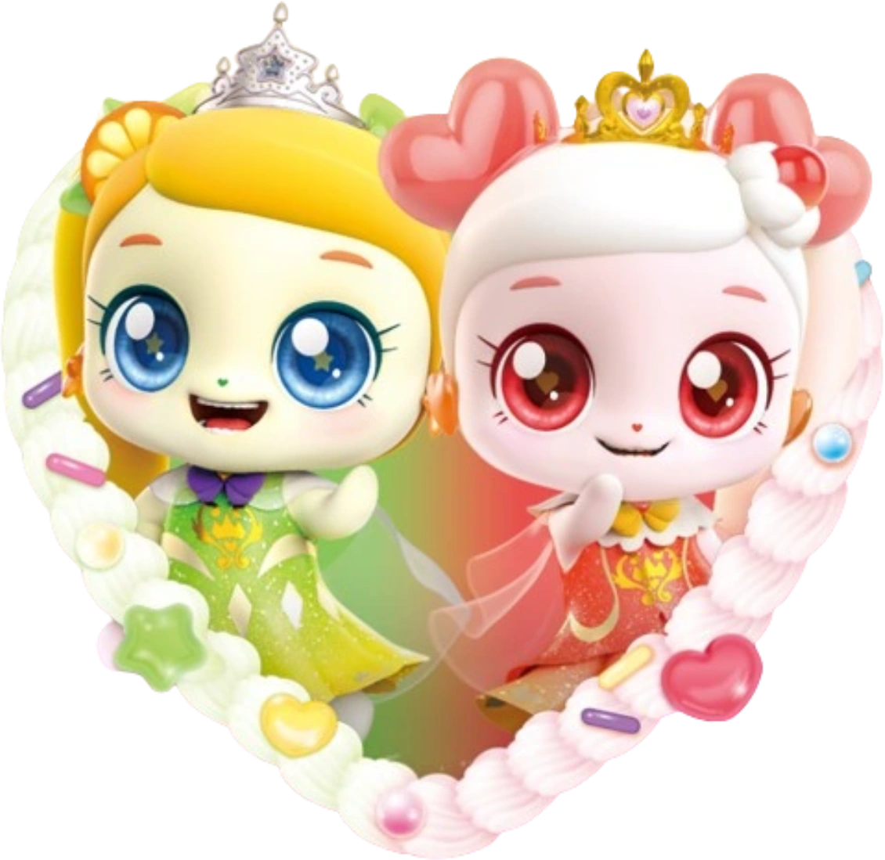

# Hiya!
I'm chocohearts.

<svg fill="none" viewBox="0 0 600 200" width="600" height="200" xmlns="http://www.w3.org/2000/svg">
  <foreignObject width="100%" height="100%">
    

      
      

        <h1>I code a lot.</h1>
      

    

  </foreignObject>
</svg>
